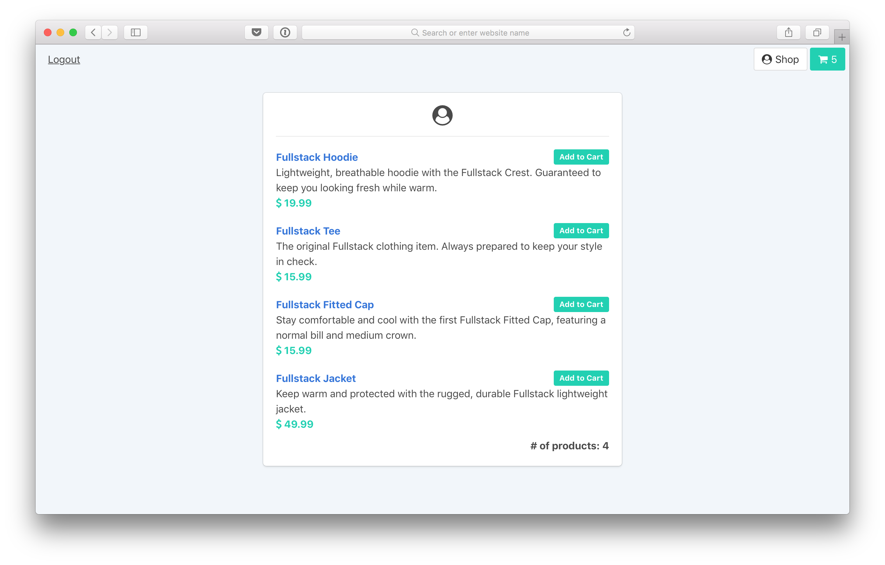
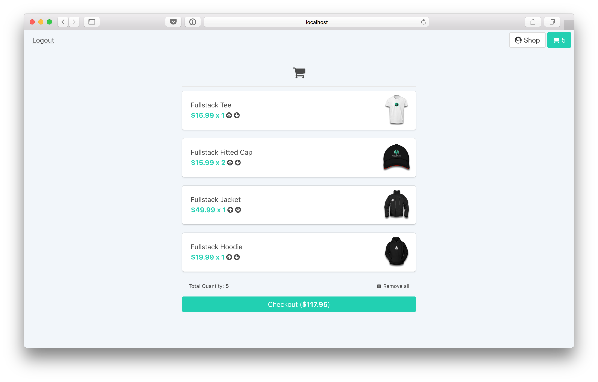

# Shopping Cart

A shopping cart built using Vue.js

### Shop Around

### View Your Cart

### Description

This shopping cart application provides the ability to add items to and remove items from your shopping cart.
It also allows users to increase/decrease the number of items in their cart. The total cost is automatically
updated and persisted to a local server (data file).

### Running the server

    npm install
    npm run start
